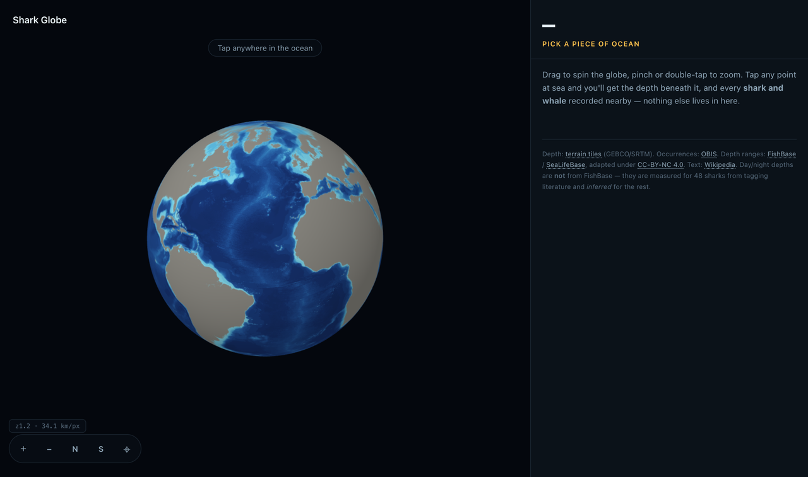
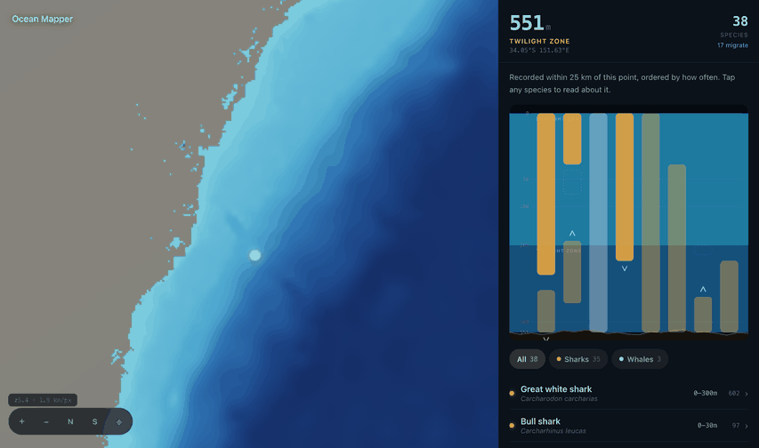
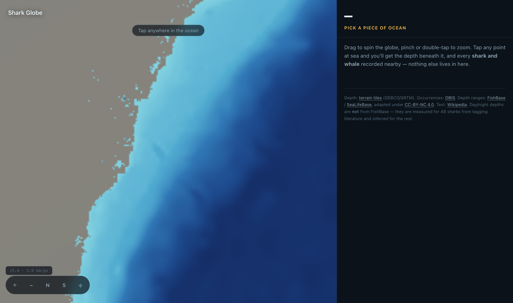
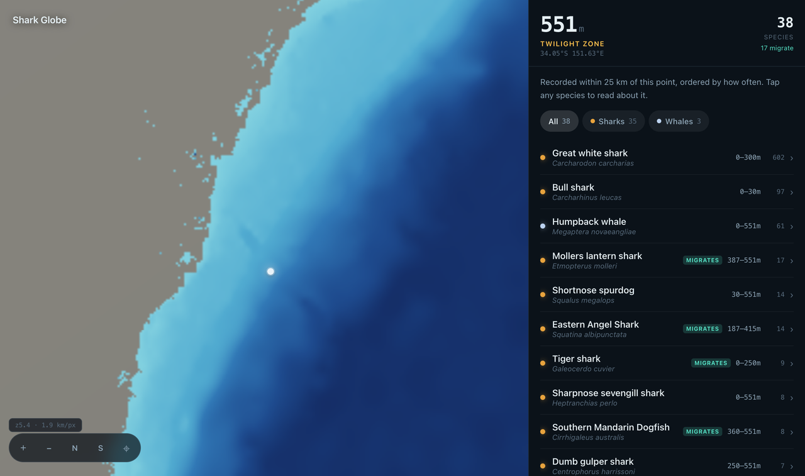
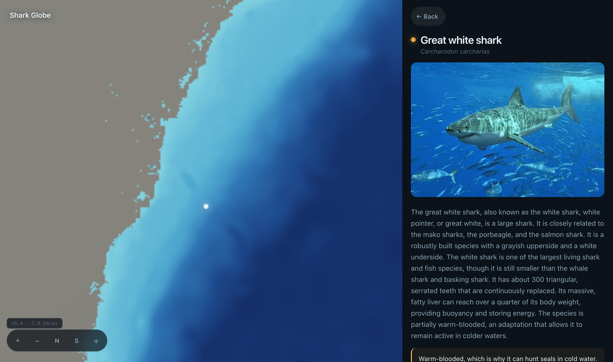

# Shark Globe

**Click anywhere in the sea. Find out how deep it is — and which sharks and whales swim there, by day and by night.**



Shark Globe is a bathymetric globe you can interrogate. Click a point at sea and
it sounds the seafloor beneath it, then tells you which **sharks and whales** have
been recorded nearby — arranged down a cross-section of the water column, at the
depths they actually occupy.

> **It is only about sharks and whales.** Not fish, not molluscs, not coral —
> those were deliberately removed. **497 sharks** (the nine shark orders: no rays,
> no skates, no chimaeras) and **42 cetaceans** (whales, dolphins, porpoises: no
> seals, no manatees). 539 species, and nothing else.

Then you press **Night**, and they move.



That movement is the point of the whole thing. Every evening, the largest
migration on Earth takes place vertically: animals that spend the day hiding in
the dark below the reach of light rise hundreds — sometimes thousands — of metres
to feed at the surface, and sink again before dawn. A cookiecutter shark commutes
three kilometres, twice a day, every day of its life. It is the biggest thing
that happens on this planet, and almost nobody ever sees it.

---

## What it does

| | |
|---|---|
|  | **The ocean is drawn as depth, not as a photograph.** Land is a flat grey silhouette — context, nothing more. The colour of the water *is* the data: pale over the shelf, deep navy across the abyssal plain, near-black in the trenches. |
|  | **Click the sea and it sounds the bottom.** Depth at that exact point, the zone it falls in, and every shark and whale recorded near it — ranked by how often, with the record count shown so you can see the evidence the ranking rests on. |
|  | **Click any animal** for its depth range by day and by night, its daily rhythm, its deepest recorded dive, and a page pulled live from Wikipedia. |

---

## Running it

**The easy way** — grab `SharkGlobe.app` from
[Releases](../../releases), drag it to Applications, and launch it. It runs
entirely on your machine; nothing is uploaded anywhere. It lives in the menu bar
(🦈) and opens the globe in your browser.

It isn't code-signed, so macOS will refuse the first launch. Right-click → **Open**
→ **Open**. (Or `xattr -dr com.apple.quarantine SharkGlobe.app`.)

**From source** — needs Python 3.9+, nothing else:

```bash
python3 server.py          # → http://localhost:8000
```

That's it. No npm, no bundler, no build step. The app has **zero runtime
dependencies** — the globe is hand-written WebGL2.

---

## How it works

**The globe is ours.** It began on deck.gl and outgrew it: deck re-tessellated
every polygon whenever the zoom changed, and ran a whole GPU picking pass on every
mouse move. It's now ~500 lines of raw WebGL2 — a textured sphere, terrain patches
streamed as you zoom, and a marker. Clicking is a ray/sphere intersection on the
CPU: no picking buffer, no readback, no stall.

**Depth and the picture come from the same bytes.** The seafloor is sampled from
terrain-RGB tiles, where elevation is packed into the pixel colour
(`R·256 + G + B/256 − 32768` metres). Those same tiles are decoded and painted onto
the sphere, so what you *see* and what the app *reports* cannot drift apart. Below
zoom 4 a pre-baked whole-planet basemap takes over — 21 colours, banded into real
bathymetric contours, 870 KB.

**Species come from three places.** [OBIS](https://obis.org) says *what has been
recorded where* — queried for **Selachii** (sharks) and **Cetacea** (whales) only,
so a coastal click fetches 50 taxa instead of 1,300. FishBase and SeaLifeBase say
*how deep each animal lives*. And the day/night behaviour comes from… nowhere, so
it had to be built. See below, because it matters.

---

## Being honest about the data

This is the part I'd want to read first.

### The day/night depths are measured for 48 sharks and *inferred* for the rest

No public database holds diel vertical migration as a queryable field. Not
FishBase (its 216 tables have a circadian column — it is empty for every shark).
Not WoRMS. Not Sharkipedia. That data lives in tagging papers, one species at a
time.

So: **48 sharks are hand-curated** from the telemetry and survey literature — the
cookiecutter, the sixgill, the bigeye thresher, the megamouth. Those are real
numbers from real papers.

Every other species is **inferred** by one rule: *a pelagic animal whose depth
range reaches the twilight zone is almost certainly a vertical migrator.* It's a
good rule — it's the mechanism behind the deep scattering layer — but it is a rule,
not an observation. Inferred bars are drawn translucent and tagged `inferred`, and
the species page says so plainly. Where we don't know, the app says **unknown**
rather than guessing: 358 of 539 species say exactly that.

### Record counts measure how hard people looked, not how much is there

The ranking is by OBIS record count, and that number is **observer effort**, not
abundance. Two examples the app itself surfaces:

- **The oceanic whitetip** turns up almost everywhere in the tropics, often ranked
  1st — sometimes on a *single sighting*, because a mid-ocean point may hold only
  four sharks on record in total. It's over-represented because nearly all
  open-ocean shark records come from **pelagic longline fisheries observers**, and
  it was the classic bycatch species. It is Critically Endangered, down >95% in
  much of its range. It saturates the data because we catalogued it while wiping it
  out. You are very unlikely to meet one.

- **The great white** is rank 1 within 30 km of Sydney (1,500+ records) and
  **vanishes entirely** 70 km out. Not because it isn't there — they cross oceans —
  but because every record comes from beach meshing, drumlines and inshore
  sightings. Past the shelf break, nobody is watching.

The app shows the record count on every row, in amber when it's fewer than five,
and warns you when the top of the ranking rests on almost nothing.

### The open ocean is barely surveyed at all

Click the middle of the Pacific and you may get four species. That is not an
absence of life. It is an absence of anyone looking.

---

## Building the data yourself

```bash
python3 -m pip install --user duckdb Pillow numpy

python3 scripts/build_species.py   # → data/species.json  (539 species, 130 KB)
python3 scripts/build_basemap.py   # → data/basemap.png   (whole planet, 870 KB)
python3 scripts/build_app.py       # → dist/SharkGlobe.app
```

And to check nothing is broken — in a real browser, not by grepping:

```bash
python3 scripts/verify.py --click
```

It drives headless Chrome over the DevTools protocol: links the module graph,
compiles the shaders, clicks the globe, and asserts a depth comes back. It has
earned its keep — it caught the fact that terrain tiles carry **no bathymetry past
zoom 10** (the ocean tiles are all zeros), which made every ocean click read as
dry land.

---

## Sources and licences

| What | Source | Licence |
|---|---|---|
| Depth / terrain | [Terrain Tiles](https://registry.opendata.aws/terrain-tiles/) (GEBCO, SRTM) | Open |
| Occurrences | [OBIS](https://obis.org) | CC-BY |
| Depth ranges | [FishBase](https://www.fishbase.org) / [SeaLifeBase](https://www.sealifebase.org) (Froese & Pauly; Palomares & Pauly, 2025) | **[CC-BY-NC 4.0](https://creativecommons.org/licenses/by-nc/4.0/)** |
| Species text | [Wikipedia](https://en.wikipedia.org) | CC-BY-SA |
| Day/night for 48 sharks | Tagging & survey literature, hand-curated | — |

The **code** is MIT (see `LICENSE`) — do what you like with it.

`data/species.json` is a **derivative work** of FishBase and SeaLifeBase, used
under [CC-BY-NC 4.0](https://creativecommons.org/licenses/by-nc/4.0/). That
licence explicitly permits redistributing an adaptation like this one, provided
it's credited, the licence is linked, the changes are stated, and it isn't used
commercially. All four are covered in **[`data/species.SOURCES.md`](data/species.SOURCES.md)**,
which records exactly what was taken (depth range, habitat, taxonomy), what was
filtered out (44,140 species → 539), and — importantly — what was **added**.

> ⚠️ **The `day` / `night` / `dvm` fields are not FishBase data.** No database
> holds diel vertical migration as a queryable field. Those values are inferred by
> a rule of ours, or hand-curated from tagging papers for 48 sharks. Please don't
> cite them as FishBase's.

---

## Known limits

- **Bathymetry stops at ~150 m/pixel.** Past zoom 10 the source has nothing; the
  last real tiles are magnified rather than invented.
- **Whales dominate the rankings** in many places, because whale-watching boats log
  everything they see and sharks are underwater. Use the **Sharks** filter.
- **Sharks and whales only, by design.** Rays, skates and chimaeras are excluded —
  they aren't sharks. So are seals and manatees, which aren't whales. If you want
  the other 43,601 marine species back, one set in `scripts/build_species.py`
  (`KEEP_ORDERS`) restores them.
- **It needs the internet** for OBIS and for terrain tiles it hasn't cached yet.
  Once cached, it works offline.
